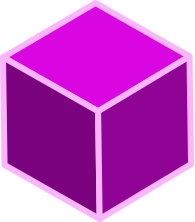

<div align="center">


# MaDam3D 


<br/>


## Manage your 3D printer files from your browser.

[👉 GIVE IT A TRY 👈](philstenning.github.io/madam3d/)

</div>


MaDam3D is a project to view and manage/organize and share your .stl .3mf and .gcode files. 

The idea was inspired by [van_dam](https://github.com/Floppy/van_dam) but uses only
the web browser and its capabilities to do everything. You can clone and build this repo yourself, but it is the same version that is the current main branch.

___
## The Client

You can try it out at [madam3D](https://philstenning.github.io/madam3D/) but you will need a supported browser [caniuse](https://caniuse.com/?search=File%20System%20Access%20API)

This project is still very much a work in progress but the basic functionality exists.

### __How to use__

Open the [app in your browser](https://philstenning.github.io/madam3D/) and navigate to the folder page, from there you can add folders from your native file system. 

When you add a folder it will recursively scan your drive from that point, so if you have a lot of nested files it might take some time

There are some folder/directories that can't be opened from the browser and this will differ depending from which os and browser you are using, on windows the c: or Program Files for example.

The app makes the assumption (at the moment) that each folder is a model, and the files within are its parts. 

Folder Features:
- Filter models with the search box at top of page. 
<!-- - TODO:  Select the file types that you want to show/hide - toggle the filter button  -->

___

### Server
// TODO

Serves the client app and handles the sharing of your projects with others.


____

See the individual package readme.md files for how each package works. 

This project uses pnpm workspaces packages and publishing them.

Folder/App structure is as follows: 
```
root/
 |── packages/
 |   └──  client/
 |   └── server/
```

## Getting started
You will need Nodejs installed on your machine(it is built and tested with ^16).  
To run this project locally, you will need pnpm to manage the dependencies/workspaces.

```sh
# install pnpm as a global dependency
npx pnpm add -g pnpm
```


```sh
# install the dependencies
pnpm i
```

<!-- Now you can run the development servers: -->

```sh
# start the dev servers
# It will start the client and server apps.
pnpm dev
```
In your browser check:

 http://localhost:3000 for the client

 http://localhost:3001 for the server

 The desktop app should start.

## Testing

```
pnpm test
```